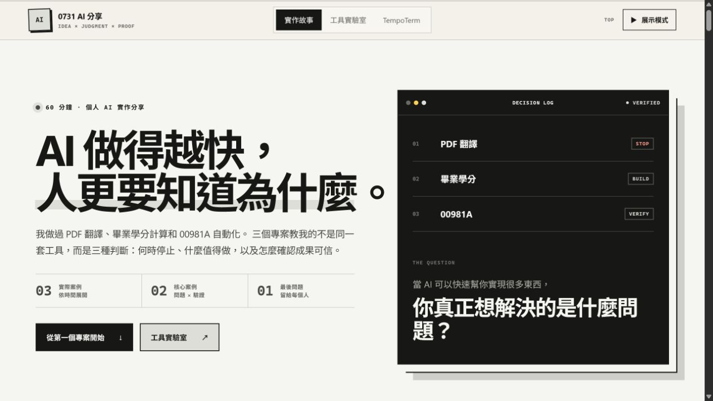
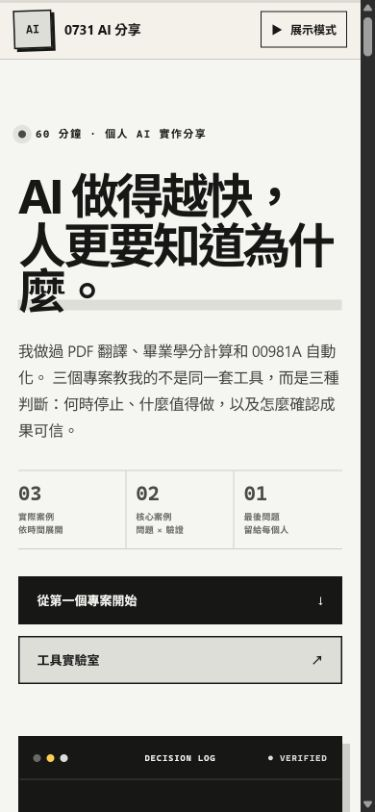
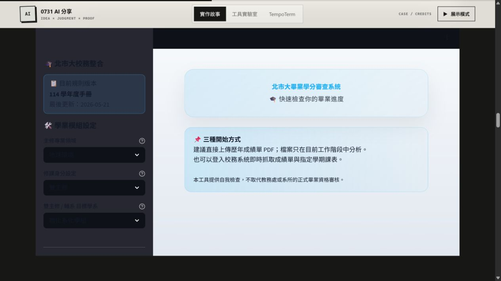
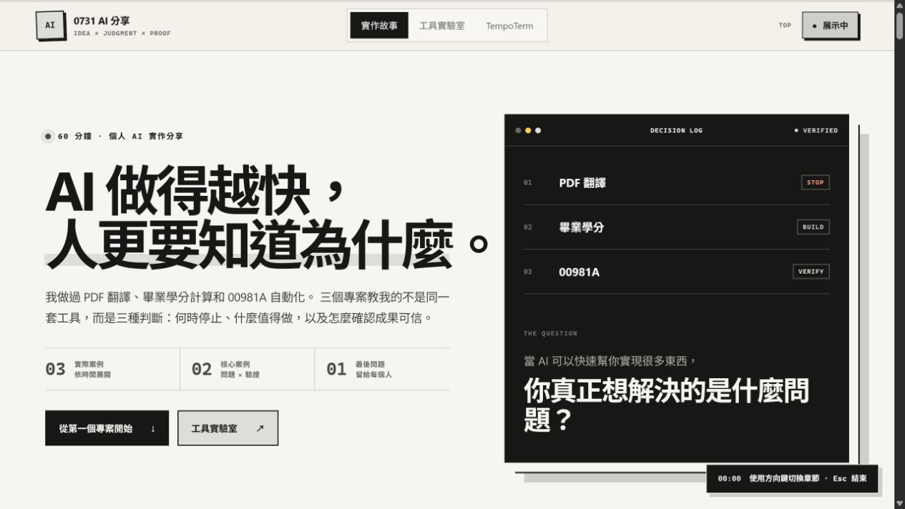
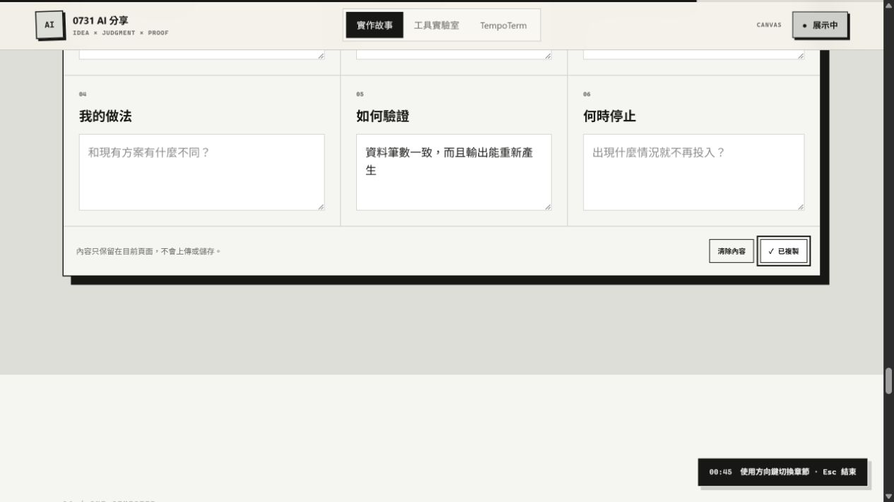
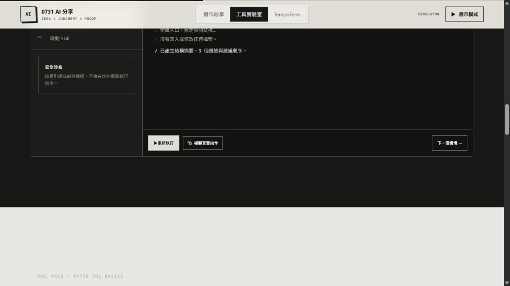

# 瀏覽器 QA 報告

驗證日期：2026-07-29  
工具：Codex Browser 的 Playwright 介面  
測試網址：本機 `http://localhost:3000`

## 驗證結果

| 項目 | 證據 | 結果 |
| --- | --- | --- |
| 首頁載入 | H1、主導覽與三案例均存在；初始 iframe 數量為 0 | 通過 |
| 首頁至教學頁 | `/lab` 連結與靜態輸出路由均存在 | 通過 |
| 教學頁至 TempoTerm | 實際點擊後到達 `/tempo` | 通過 |
| Skills 平台與來源篩選 | 平台具 `role="tab"`／`aria-selected`；來源具 `aria-pressed`；篩選後詳情同步，無結果時顯示狀態文字 | 通過 |
| 終端模擬器 | 選擇「唯讀分析資料夾」，狀態由 `SAFE DEMO` 到 `COMPLETE`，輸出四行預期結果 | 通過 |
| 學分 Demo 閘門 | 點擊前 0 個 iframe；點擊後來源為 `jinjia0618-utaipei-student.hf.space`；卸載後回到 0 | 通過 |
| 學期作品集閘門 | 點擊後來源為 `sapphirejimmy-seismology-final.static.hf.space`；卸載後回到 0 | 通過 |
| 問題畫布 | 可輸入、完成度更新、複製按鈕顯示「已複製」 | 通過 |
| 展示模式 URL | `?present=1` 初次載入即為 `aria-pressed="true"` 並顯示計時提示 | 通過 |
| 展示模式鍵盤 | 方向鍵由 `top` 切到 `thesis`；Escape 關閉 | 通過 |
| 輸入框方向鍵 | 文字框位於可視範圍並取得焦點時，方向鍵不改變章節或捲動位置 | 通過 |
| Lightbox | 開啟後焦點位於「關閉」按鈕且 body 鎖定；Escape 後 dialog 移除 | 通過 |
| 390px 手機版 | `scrollWidth === clientWidth === 375`；首屏 Grid 同寬；0 張破圖 | 通過 |
| 主控台 | 三頁與互動流程結束後沒有 error 或 warning | 通過 |

鍵盤測試以原生 `<a>`、`<button>`、`textarea` 與可見 focus 樣式為基礎；方向鍵、Escape 與焦點隔離另外以 Playwright 實際事件驗證。

## QA 截圖

### 首頁桌機版

### 首頁手機版

### 學分案例

截圖只載入公開初始畫面，沒有輸入帳密、學號或修課資料。

### 展示者模式

### 問題畫布

輸入內容為 QA 用的一般文字，不含個人資料。

### 工具實驗室

## 訪談後的規格調整

- 原始任務偏好學分案例使用假資料前端 Demo；Jimmy 後續明確選擇直接嵌入既有 Space，因此 QA 驗證的是「風險提示 → 點擊載入 → 卸載」流程，不登入校務系統，也不提交資料。
- 原始任務規劃獨立作品牆；Jimmy 後續指定完整嵌入既有學期作品網站，因此 QA 改驗證整站 iframe 閘門與桌機提示，沒有重建或虛構作品資料。
